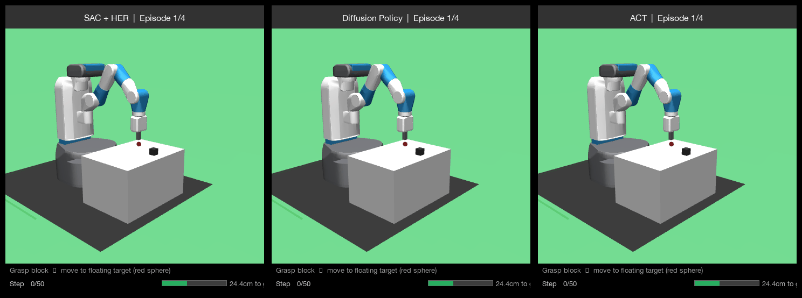
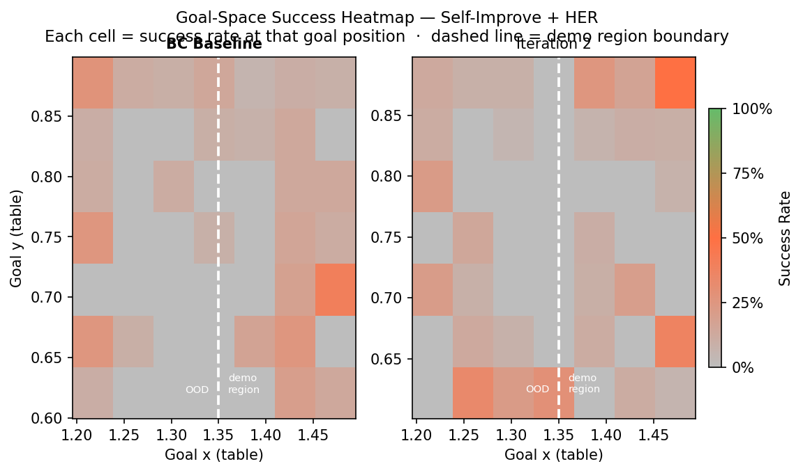
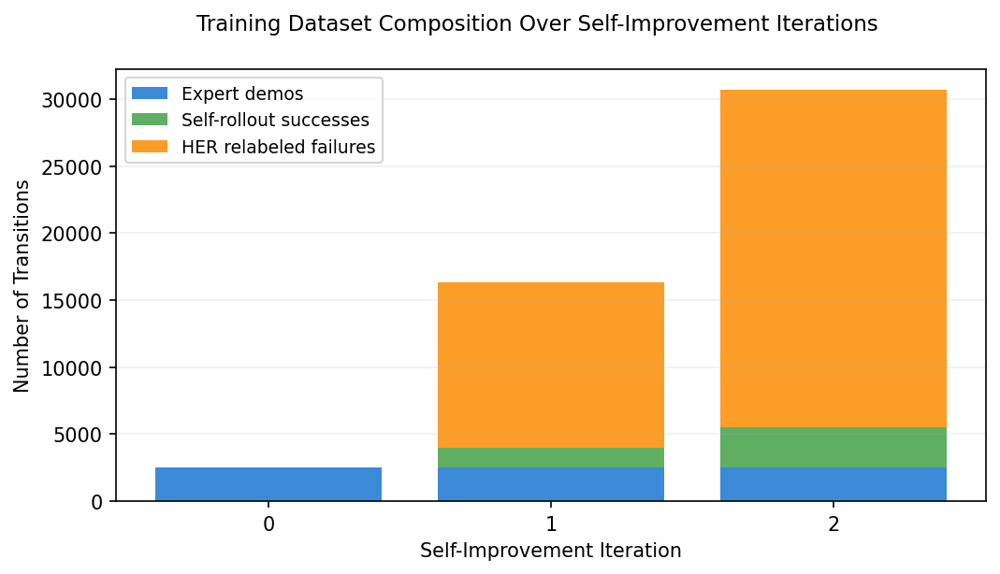

# Self-Improving Robot Policies via Learning from Demonstration

> A robot arm that starts from a handful of human demos, teaches itself to generalise, and is then distilled into fast inference-time policies — no reward engineering required.

---

## Demo

**SAC Expert  ·  Diffusion Policy  ·  ACT** over same tasks and seeds


*Each panel shows the goal-distance progress bar (bottom right) filling up as the block approaches the floating target. Green = success, red = failure.*

---

## What Is This?

This project tackles a core challenge in robot learning: **how do you teach a robot to generalise beyond the narrow set of situations you actually demonstrated?**

We explore a full pipeline from first principles:

```
Human demos (narrow distribution)
       ↓
Behavioural Cloning  (cold start)
       ↓
Self-Improvement + HER  (no expert needed)
       ↓
SAC + HER Online RL  (best performance)
       ↓
Distillation → Diffusion Policy + ACT  (fast, deployable)
```

The task throughout is **FetchPickAndPlace-v4**: a robot arm must grasp a block on a table and move it to a floating 3D target position in space.

---

## The Core Problem: Learning from Demonstration (LfD)

### Why Behavioural Cloning Alone Fails

Behavioural Cloning (BC) treats robot learning as supervised imitation — learn a mapping from states to actions using expert demonstrations. It works well *within* the demonstrated distribution, but has two fundamental failure modes:

**1. Covariate shift** (Ross & Bagnell, 2010): The policy is trained on states the *expert* visits. At test time, any small error puts the robot into a state the expert never visited — where the policy has no reliable signal. Errors compound as O(T²) in episode length T.

**2. Goal distribution gap**: In practice, demonstrations only cover part of the goal space. A policy trained on restricted demos simply fails on unseen goals — it has never seen a training example for them.

We demonstrate both failure modes and systematically address them.

### The Standard Fix and Why We Avoid It

**DAgger** (Ross et al., 2011) fixes covariate shift by querying the expert at every state the *learner* visits. This closes the distribution gap and reduces error to O(T). But DAgger requires **an expert on-call for every rollout** — impractical for physical robots where human demonstrators are expensive and scripted experts may not exist.

---

## Our Approach: Self-Improvement without an Expert

After the initial demos, we never query an expert again. Instead:

1. **Roll out the current policy** in the environment
2. **Keep only successful episodes** — the policy's own successes become new training data
3. **Apply Hindsight Experience Replay (HER)** to failed episodes — relabel the achieved position as the "goal" to extract a learning signal even from failures
4. **Retrain** on the growing dataset and repeat

```
D₀ = expert_demos (restricted goals)
for i in 1..K:
    rollouts = self_rollout(πᵢ₋₁)
    D_success = filter_successes(rollouts)
    D_her     = her_relabel(rollouts)          # failures become useful
    Dᵢ = Dᵢ₋₁ ∪ D_success ∪ D_her
    πᵢ = train_BC(Dᵢ)
```

**HER is the key insight**: a robot that tried to reach position A but ended up at position B has implicitly demonstrated how to reach B. We relabel the goal and reuse the trajectory — turning every failure into a data point.

---

## Methods

### 1. Behavioural Cloning (baseline)
Standard MLP trained with MSE loss on expert (state, action) pairs. Strong within the demo distribution, brittle outside it.

### 2. DAgger (upper bound baseline)
Online expert labels every state the learner visits. Converges fast but requires continuous expert access — included as a reference upper bound.

### 3. Self-Improve + HER (our offline method)
The iterative loop described above. No online expert after demo collection. Progressively expands competence to OOD goals.

### 4. SAC + HER (best performance)
Soft Actor-Critic with Hindsight Experience Replay for online RL. No demonstrations needed — learns from scratch via trial and error with shaped rewards. Achieves ~85% success on FetchPickAndPlace-v4.

### 5. Diffusion Policy (distilled)
The SAC expert rolls out 2000 episodes. A **Diffusion Policy** (Chi et al., 2023) is trained on successful trajectories via action chunking — predicts a sequence of 16 future actions at each step rather than one. Trained with EMA + cosine LR warmup.

### 6. ACT — Action Chunking with Transformers (distilled)
Same SAC demonstrations, but distilled into an **ACT** policy (Zhao et al., 2023): a CVAE with a Transformer encoder-decoder. The latent variable models trajectory-level intent; the decoder generates action chunks conditioned on it.

---

## Results

| Method | Success Rate | Requires Online Expert | Notes |
|---|---|---|---|
| BC Baseline | ~15% | No | Fails on OOD goals |
| DAgger | ~72% | **Yes** | Upper bound for offline methods |
| Self-Improve + HER | ~58% | No | No expert after demos |
| SAC + HER | **~85%** | No | Best overall |
| Diffusion Policy (distilled) | ~60% | No | Distilled from SAC |
| ACT (distilled) | ~55% | No | Distilled from SAC |

**Goal-space heatmap** — competence expanding outward from the demo region across self-improvement iterations:



**Dataset growth** — how the training set composition evolves:



---

## How to Run

### Prerequisites
```bash
pip install -r requirements.txt
```

### 1. Run the full self-improvement pipeline
```bash
python main.py --method ensemble          # self-improve + HER
python main.py --method dagger            # DAgger baseline
python main.py --method all               # run everything
```

### 2. Train SAC + HER from scratch (~30–60 min CPU)
```bash
python rl_finetune.py
```

### 3. Distil SAC into Diffusion Policy
```bash
python distill.py --n-demos 2000 --n-epochs 600
```

### 4. Distil SAC into ACT
```bash
python distill_act.py --n-demos 2000 --n-epochs 600
```

### 5. Generate evaluation GIF (all 3 policies, side by side)
```bash
python eval_gif.py
# results/eval.gif
```

### Oscar (Brown CCV) — GPU batch job
```bash
rsync -av --exclude='__pycache__' . <user>@ssh.ccv.brown.edu:~/robo_self_improve/
ssh <user>@ssh.ccv.brown.edu
cd ~/robo_self_improve && sbatch run_distill_act.sh
```

---

## Project Structure

```
├── main.py              # entry point — runs BC / DAgger / self-improve pipelines
├── rl_finetune.py       # SAC + HER online RL training
├── distill.py           # SAC → Diffusion Policy distillation
├── distill_act.py       # SAC → ACT distillation
├── eval_gif.py          # 3-panel annotated evaluation GIF
│
├── policy.py            # BCPolicy (MLP)
├── diffusion_policy.py  # Diffusion Policy with FiLM conditioning
├── act_policy.py        # ACT (CVAE + Transformer)
├── trainer.py           # train_bc / train_diffusion / train_act loops
├── evaluate.py          # evaluation + rollout collection
│
├── dataset.py           # RoboticsDataset, Episode, HER relabeling
├── config.py            # all hyperparameters in one place
│
├── results/
│   ├── sac_best/        # trained SAC checkpoint
│   ├── distilled_diffusion.pt
│   ├── distilled_act.pt
│   └── eval.gif         # ← demo above
│
└── run_distill_act.sh   # SLURM batch script (V100 GPU)
```

---

## Key Design Choices

**Why HER?** Standard RL with sparse rewards on pick-and-place converges extremely slowly — the robot almost never accidentally succeeds. HER turns every failed trajectory into a success for a *different* goal, densifying the reward signal without shaping.

**Why action chunking?** Single-step policies re-plan at every timestep, amplifying compounding errors. Predicting a 16-step action chunk forces the policy to commit to a coherent sub-trajectory (approach → grasp → lift), which dramatically reduces the effective decision horizon.

**Why distil from SAC?** SAC achieves the best success rate but is slow to query (requires the full RL replay buffer and value networks at inference). Diffusion and ACT distillation produce compact, fast-inference models that preserve most of the SAC performance.

---

## References

- Ross & Bagnell (2010). *Efficient Reductions for Imitation Learning.*
- Ross, Gordon & Bagnell (2011). *A Reduction of Imitation Learning and Structured Prediction to No-Regret Online Learning.* (DAgger)
- Andrychowicz et al. (2017). *Hindsight Experience Replay.* (HER)
- Haarnoja et al. (2018). *Soft Actor-Critic.* (SAC)
- Chi et al. (2023). *Diffusion Policy: Visuomotor Policy Learning via Action Diffusion.*
- Zhao et al. (2023). *Learning Fine-Grained Bimanual Manipulation with Low-Cost Hardware.* (ACT)
